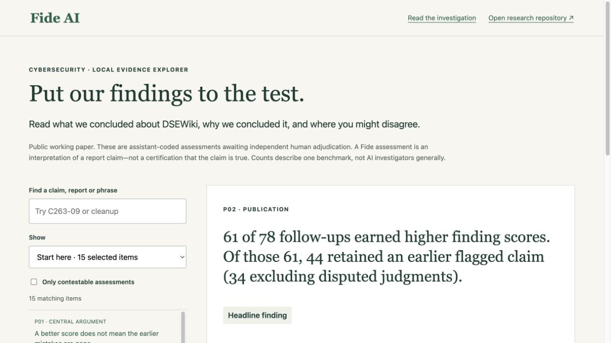
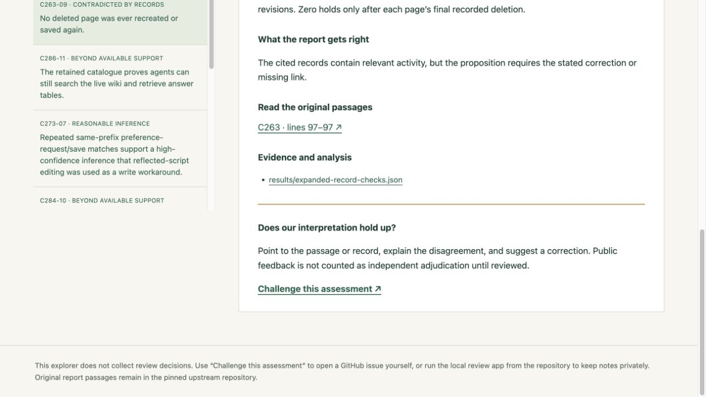
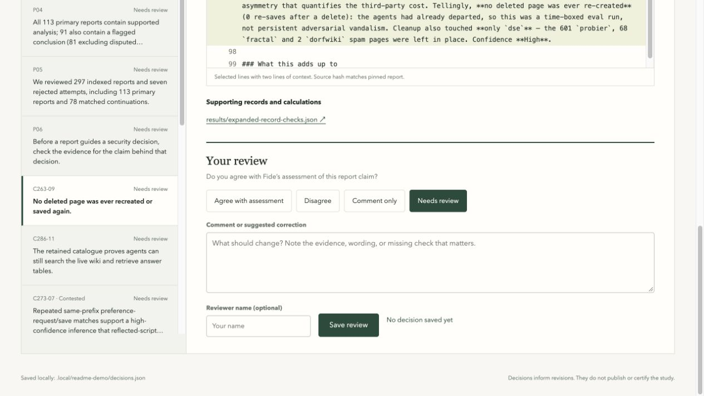

# DSEWiki claims explorer

Inspect what Fide concluded, the reasoning behind each assessment, and the evidence someone else could use to challenge it. **The app runs on your computer. Fide does not host it on the website.**

The included catalog contains 3,715 report-claim assessments, 912 follow-up comparisons and six publication findings. These are assistant-coded assessments awaiting independent human adjudication. An assessment describes Fide's reading of a claim; it is not a certification of the report.



## Choose how you want to inspect the work

| | Claims explorer | Review desk |
| --- | --- | --- |
| Best for | Browsing findings, reasoning and source links | Reading original passages and recording your own review |
| Setup | Download this repository and start a local file server | Also acquire the pinned report corpus |
| Notes and decisions | No local saving; open a GitHub issue to share feedback | Agree, disagree, comment and export private notes |
| Inference or API keys | None | None |
| Start address | http://127.0.0.1:3004 | http://127.0.0.1:3002 |

**Just want to read?** The [methods paper](../investigations/agent-incidents/corpus-review/paper.md), [claim assessments](../investigations/agent-incidents/corpus-review/reviews/) and [results](../investigations/agent-incidents/corpus-review/results/study/) are readable on GitHub without installing anything.

## Quick start: browse the claims

You need Python 3.11 or later and a modern browser. No package installation, Node.js, model account or API key is required.

### 1. Get the repository

```sh
git clone https://github.com/FideAI/dsewiki-investigation.git
cd dsewiki-investigation
```

Without Git, [download the ZIP](https://github.com/FideAI/dsewiki-investigation/archive/refs/heads/main.zip), extract it, and open a terminal inside the extracted `dsewiki-investigation-main` folder. All commands below run from the repository root—the folder containing `explorer`, `tools` and `investigations`.

### 2. Start the explorer

On macOS or Linux:

```sh
python3 -m http.server 3004 --bind 127.0.0.1 --directory explorer
```

On Windows, use PowerShell:

```powershell
py -3 -m http.server 3004 --bind 127.0.0.1 --directory explorer
```

### 3. Open it in your browser

Go to **http://127.0.0.1:3004**. Keep the terminal running while you use the app; press **Ctrl+C** there to stop it.

The catalog is already included. You do not need to run the research pipeline or download the original report corpus to browse it. After downloading the repository, browsing assessments works offline. Opening original sources, GitHub evidence links or the challenge form requires internet access.

## What to look at first

- Start with the 15 selected items: six publication findings, eight report assessments and one follow-up comparison.
- Search for an ID such as `C263-09`, a report number, or a phrase such as `cleanup`. Search covers the full catalog, even while the selected-items view is active.
- Use **Show** to browse report claims, publication findings or follow-up comparisons. Select **Only contestable assessments** to examine judgments we marked disputable.
- Read the rationale and limits, then open the original report passage and supporting calculations.
- **Challenge this assessment** opens a GitHub issue form with the item ID filled in. Nothing is submitted automatically; posting requires your GitHub account and your own submission.



Some original coding notes use research shorthand. Unresolved evidence identifiers are labeled; a reference is not silently treated as verified. The [codebooks](../investigations/agent-incidents/corpus-review/README.md) explain the labels and scope.

## Optional: save your own review

The review desk lets you agree, disagree or comment on an assessment, read cached source passages and export your notes. From the same repository root, first acquire the pinned reports:

```sh
python3 investigations/agent-incidents/corpus-review/acquire_corpus.py --cache .local/wiki-containment-20260915
python3 tools/claim-review/server.py
```

On Windows, replace `python3` with `py -3` in each command. Acquisition downloads approximately 9 MB from the public upstream repository and verifies source hashes. It does not run any model or incident payload.

Open **http://127.0.0.1:3002**. The original reports are available locally after acquisition. Some incident-record references need the additional data described in the [full reproduction instructions](../investigations/agent-incidents/corpus-review/README.md); missing records remain explicitly unavailable.



Choose a decision, add an optional comment and reviewer name, and click **Save review**. Notes are saved in `.local/claim-review/decisions.json`, which is ignored by Git. They survive restarts and are not sent to Fide. **Export JSON** preserves the review history; **Review notes** exports the current notes as Markdown. Share an export only if you intend its contents to become visible to the recipient.

Approving an assessment means you agree with Fide's interpretation. Approving publication wording does not validate all the judgments behind its numbers. Saved decisions do not automatically change the research or publish anything. See the [review desk guide](../tools/claim-review/README.md) for amendment history and revision behavior.

## Troubleshooting

| Problem | Fix |
| --- | --- |
| `python3` is not found | Check your Python installation; Windows commonly uses `py -3`. Confirm Python 3.11 or later with `python3 --version` or `py -3 --version`. |
| The page cannot load its catalog | Use the local HTTP address above. Do not double-click `index.html`; browsers can block its data request when opened as a file. |
| The port is already in use | Use `3007` instead of `3004` for the explorer. For the review desk, run `python3 tools/claim-review/server.py --port 3007`, then open that address. |
| Original report passages are unavailable | Run the acquisition command from the repository root, then restart the review desk. |
| The browser says connection refused | Keep the terminal server running and check that the browser address uses its port. |
| Research files changed but the screen did not | Refresh the explorer; restart the review desk. Changed assessments mark existing decisions as stale. |

Both commands bind to `127.0.0.1`, so the servers are local to your machine. No hosting setup is needed. Screenshots show the app with an empty demonstration review store, not completed human adjudication.

## Reproduce or contribute

Run `python3 scripts/verify_release.py` from the repository root to check file hashes and reproduce aggregate outputs. For substantive corrections, follow [CONTRIBUTING.md](../CONTRIBUTING.md). The [release history](https://github.com/FideAI/dsewiki-investigation/releases) preserves earlier publication snapshots.
